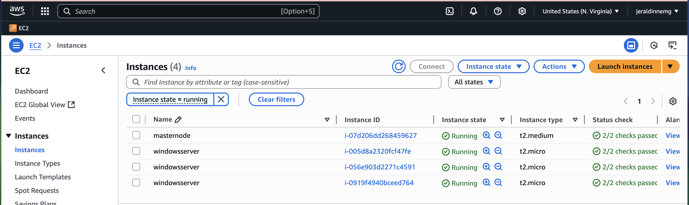

# Datadog Agent Deployment on Multiple Windows Hosts with Ansible

This project automates the installation and configuration of the **Datadog Agent** on **Windows EC2 instances** using **Ansible**   

---

## Requirements

- AWS account with:
  - Linux control node (tested on Amazon Linux 2023).
  - One or more Windows target EC2 instances.
- Windows hosts with WinRM enabled and configured.
- Control node with:
  - Python 3 & pip
  - Ansible >= 2.10
  - `pywinrm` Python package
  - Datadog Ansible role installed

---

## Control Node Setup

On your Linux control node (e.g., EC2 Amazon Linux):

### Install dependencies
```
sudo yum update -y
sudo dnf install -y python3 python3-pip
pip3 install --user ansible
ansible --version 
```

---

### Prepare Working Directory

On your Linux control node (e.g., EC2 Amazon Linux):

```
mkdir -p ~/datadog-agent
cd ~/datadog-agent
```

##  Install Ansible Roles & Collections

```
ansible-galaxy collection install ansible.windows --force
ansible-galaxy install datadog.datadog
```

## Install Python WinRM Libraries

``` 
pip3 install --user "pywinrm[credssp]" requests
```

##  Windows Hosts Setup

Launch one or more Windows Server EC2 instances in the same VPC.
Allow inbound:
RDP: TCP/3389
WinRM HTTP: TCP/5985
WinRM HTTPS: TCP/5986 (recommended)

## Enable WinRM
On each Windows host, open PowerShell as Administrator and run:
```
winrm quickconfig -q
winrm set winrm/config/service '@{AllowUnencrypted="true"}'
winrm set winrm/config/service/auth '@{Basic="true"}'
```

# Enable HTTPS & firewall
```
New-NetFirewallRule -Name "WinRM_HTTPS" `
  -DisplayName "WinRM over HTTPS" `
  -Enabled True `
  -Direction Inbound `
  -Protocol TCP `
  -LocalPort 5986 `
  -Action Allow
```

## Test Connectivity
Check if Ansible can reach all Windows hosts:

```
ansible -i ansible/inventory windows -m win_ping --ask-vault-pass
```

Expected output:

win-host-1 | SUCCESS => { "ping": "pong" }
win-host-2 | SUCCESS => { "ping": "pong" }

## Run Datadog Playbook
Run the playbook on all Windows hosts:

```
ansible-playbook -i ansible/inventory ansible/datadog.yml --ask-vault-pass
```
## Application
- AWS EC2 instances

- Windows Manager

- Datadog Metrics Monitoring Machine: 52.91.216.1 
 Machine: 52.44.139.186 
- Datadog Metrics Monitoring
